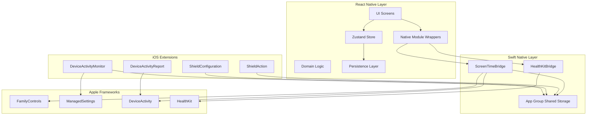
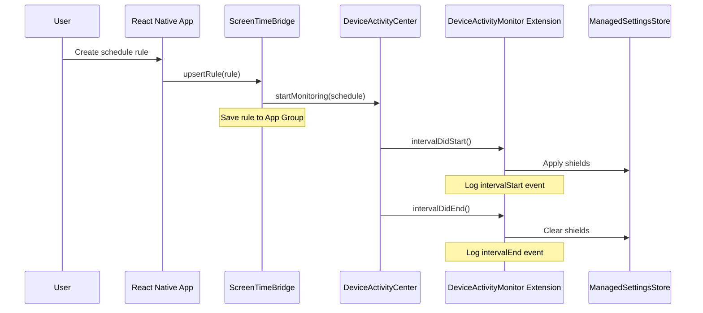
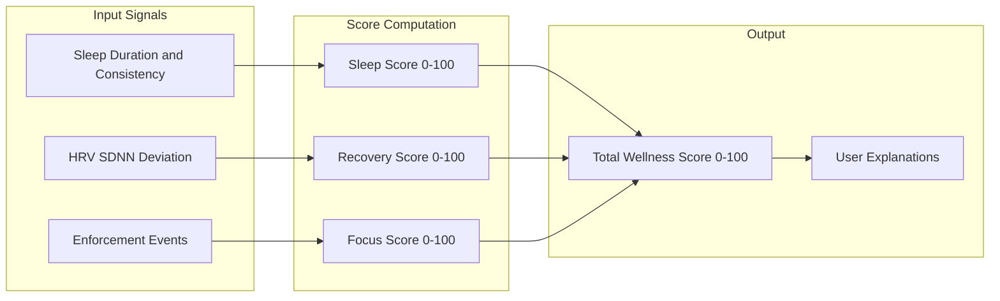

# PeaceSet iOS Wellness App - Architecture and Implementation Plan

## Architecture Brief

### System Overview

PeaceSet is a local-first iOS wellness app that helps users reduce compulsive phone use through Screen Time enforcement and provides insights via a wellness score combining HealthKit and usage data.



### Key Architectural Decisions

| Decision | Choice | Rationale ||----------|--------|-----------|| State Management | Zustand | Lightweight, TypeScript-first, simpler than Redux for this scope || Local Database | SQLite (react-native-sqlite-storage) | Mature, performant, good for time-series data || iOS Target | iOS 16.0+ | Required for full DeviceActivityReport API support || Native Bridging | Classic RN Native Modules | TurboModules add complexity; classic modules work well || App Group | group.com.peaceset.shared | Required for extension data sharing |

### Data Flow for Enforcement



### Wellness Score Computation



**Score Weights (configurable):**

- Sleep Score: 35%
- Recovery Score: 30%
- Focus Score: 35%

---

## Proposed File Tree

```javascript
/PeaceSet
├── README.md
├── docs/
│   ├── architecture.md
│   └── privacy.md
├── app/                                    # React Native app
│   ├── package.json
│   ├── tsconfig.json
│   ├── babel.config.js
│   ├── metro.config.js
│   ├── index.js
│   ├── App.tsx
│   ├── jest.config.js
│   └── src/
│       ├── core/
│       │   ├── config.ts                   # Feature flags, scoring weights
│       │   ├── logger.ts
│       │   └── constants.ts
│       ├── domain/
│       │   ├── types.ts                    # All domain types
│       │   ├── scoring/
│       │   │   ├── index.ts
│       │   │   ├── sleepScore.ts
│       │   │   ├── recoveryScore.ts
│       │   │   ├── focusScore.ts
│       │   │   ├── wellnessScore.ts
│       │   │   └── __tests__/
│       │   │       ├── scoring.test.ts
│       │   │       └── fixtures.json
│       │   └── rules/
│       │       └── ruleValidator.ts
│       ├── data/
│       │   ├── db/
│       │   │   ├── database.ts
│       │   │   ├── migrations.ts
│       │   │   └── schema.ts
│       │   ├── repositories/
│       │   │   ├── rulesRepository.ts
│       │   │   ├── eventsRepository.ts
│       │   │   └── healthRepository.ts
│       │   └── storage/
│       │       └── asyncStorageKeys.ts
│       ├── native/
│       │   ├── ScreenTimeBridge.ts
│       │   ├── HealthKitBridge.ts
│       │   └── types.ts
│       ├── features/
│       │   ├── onboarding/
│       │   │   ├── screens/
│       │   │   │   ├── WelcomeScreen.tsx
│       │   │   │   ├── DisclaimerScreen.tsx
│       │   │   │   └── PermissionsScreen.tsx
│       │   │   └── components/
│       │   │       └── PermissionCard.tsx
│       │   ├── restrictions/
│       │   │   ├── screens/
│       │   │   │   ├── RestrictionsScreen.tsx
│       │   │   │   └── CreateRuleScreen.tsx
│       │   │   ├── components/
│       │   │   │   ├── RuleCard.tsx
│       │   │   │   ├── SchedulePicker.tsx
│       │   │   │   └── AppPickerButton.tsx
│       │   │   └── store/
│       │   │       └── restrictionsStore.ts
│       │   └── analytics/
│       │       ├── screens/
│       │       │   └── AnalyticsScreen.tsx
│       │       ├── components/
│       │       │   ├── WellnessScoreCard.tsx
│       │       │   ├── ScoreBreakdownCard.tsx
│       │       │   └── ScreenTimeReportView.tsx
│       │       └── store/
│       │           └── analyticsStore.ts
│       ├── ui/
│       │   ├── theme.ts
│       │   ├── Button.tsx
│       │   ├── Card.tsx
│       │   ├── Typography.tsx
│       │   └── SafeContainer.tsx
│       ├── navigation/
│       │   ├── AppNavigator.tsx
│       │   └── types.ts
│       └── store/
│           ├── appStore.ts
│           └── types.ts
├── ios/
│   ├── PeaceSet.xcodeproj/
│   ├── PeaceSet.xcworkspace/
│   ├── Podfile
│   ├── PeaceSet/
│   │   ├── AppDelegate.swift
│   │   ├── Info.plist
│   │   ├── PeaceSet.entitlements
│   │   ├── PrivacyInfo.xcprivacy
│   │   ├── Native/
│   │   │   ├── ScreenTimeBridge.swift
│   │   │   ├── ScreenTimeBridge.m
│   │   │   ├── HealthKitBridge.swift
│   │   │   ├── HealthKitBridge.m
│   │   │   └── ScreenTimeReportView.swift
│   │   └── Shared/
│   │       ├── SharedDataManager.swift
│   │       ├── RuleModel.swift
│   │       └── EventModel.swift
│   └── Extensions/
│       ├── DeviceActivityMonitorExtension/
│       │   ├── DeviceActivityMonitorExtension.swift
│       │   ├── Info.plist
│       │   └── DeviceActivityMonitorExtension.entitlements
│       ├── ShieldConfigurationExtension/
│       │   ├── ShieldConfigurationExtension.swift
│       │   ├── Info.plist
│       │   └── ShieldConfigurationExtension.entitlements
│       ├── ShieldActionExtension/
│       │   ├── ShieldActionExtension.swift
│       │   ├── Info.plist
│       │   └── ShieldActionExtension.entitlements
│       └── DeviceActivityReportExtension/
│           ├── DeviceActivityReportExtension.swift
│           ├── TotalActivityReport.swift
│           ├── Info.plist
│           └── DeviceActivityReportExtension.entitlements
└── __tests__/
    └── App.test.tsx
```

---

## Implementation Phases

### Phase 1: Bootstrap React Native App

**Objective:** Create the RN project with navigation, screens, persistence layer, and typed native module wrappers.**Steps:**

1. Initialize React Native project with TypeScript template
2. Install dependencies (React Navigation, Zustand, SQLite, AsyncStorage)
3. Create folder structure and core files
4. Implement navigation with 4 main screens (Welcome, Permissions, Restrictions, Analytics)
5. Create domain types and persistence layer stubs
6. Create typed native module wrappers with mock implementations (for Android/simulator)
7. Verify app compiles and runs on iOS simulator

**Key Files:**

- `app/package.json` - Dependencies
- `app/src/domain/types.ts` - All domain type definitions
- `app/src/native/ScreenTimeBridge.ts` - Typed wrapper with mocks
- `app/src/native/HealthKitBridge.ts` - Typed wrapper with mocks
- `app/src/navigation/AppNavigator.tsx` - Stack navigator
- Feature screens (Welcome, Permissions, Restrictions, Analytics)

---

### Phase 2: iOS Native Foundation

**Objective:** Configure Xcode project with required capabilities, App Group, and implement native bridge stubs.**Steps:**

1. Open iOS project in Xcode, configure signing
2. Add capabilities: Family Controls, HealthKit, App Groups
3. Create App Group: `group.com.peaceset.shared`
4. Implement `ScreenTimeBridge.swift` with authorization flow
5. Implement `HealthKitBridge.swift` with permission request
6. Create `SharedDataManager.swift` for App Group data access
7. Test on physical device (Screen Time APIs require device)

**Key Files:**

- `ios/PeaceSet/PeaceSet.entitlements` - Capabilities
- `ios/PeaceSet/Native/ScreenTimeBridge.swift` - Native module
- `ios/PeaceSet/Native/HealthKitBridge.swift` - Native module
- `ios/PeaceSet/Shared/SharedDataManager.swift` - Shared storage

**Xcode Configuration Checklist:**

- [ ] Team/Signing configured
- [ ] Family Controls capability enabled
- [ ] HealthKit capability enabled
- [ ] App Groups capability with `group.com.peaceset.shared`
- [ ] NSHealthShareUsageDescription in Info.plist
- [ ] Privacy manifest for HealthKit

---

### Phase 3: Screen Time Enforcement

**Objective:** Implement all 4 iOS extensions and wire end-to-end enforcement.**Steps:**

1. Create DeviceActivityMonitorExtension target
2. Create ShieldConfigurationExtension target
3. Create ShieldActionExtension target
4. Create DeviceActivityReportExtension target
5. Configure each extension with App Group entitlement
6. Implement activity picker presentation in ScreenTimeBridge
7. Implement rule persistence (save selections as tokens to App Group)
8. Implement DeviceActivityMonitor: intervalDidStart/End, eventDidReachThreshold
9. Implement ShieldConfiguration: custom branded shield UI
10. Implement ShieldAction: handle button taps, snooze logic
11. Implement DeviceActivityReport: daily summary view
12. Test full enforcement flow on device

**Key Files:**

- `ios/Extensions/DeviceActivityMonitorExtension/DeviceActivityMonitorExtension.swift`
- `ios/Extensions/ShieldConfigurationExtension/ShieldConfigurationExtension.swift`
- `ios/Extensions/ShieldActionExtension/ShieldActionExtension.swift`
- `ios/Extensions/DeviceActivityReportExtension/TotalActivityReport.swift`

---

### Phase 4: Analytics and Scoring

**Objective:** Implement HealthKit data fetching, event log reading, wellness score algorithm, and analytics UI.**Steps:**

1. Implement HealthKit queries in HealthKitBridge (sleep, HRV)
2. Implement event log reading from shared storage
3. Create scoring algorithm in TypeScript with unit tests:

- `sleepScore.ts` - Sleep duration and consistency scoring
- `recoveryScore.ts` - HRV deviation scoring
- `focusScore.ts` - Enforcement events scoring
- `wellnessScore.ts` - Composite score with weights

4. Add test fixtures and edge case tests
5. Create ScreenTimeReportView for embedding DeviceActivityReport
6. Build Analytics screen UI with score display and report embedding
7. Wire daily score computation on app open

**Key Files:**

- `app/src/domain/scoring/*.ts` - Scoring modules
- `app/src/domain/scoring/__tests__/scoring.test.ts` - Unit tests
- `ios/PeaceSet/Native/ScreenTimeReportView.swift` - Report host view
- `app/src/features/analytics/screens/AnalyticsScreen.tsx`

---

## Acceptance Criteria Summary

| Criteria | Verification ||----------|--------------|| App builds in Xcode | `npx react-native run-ios --device` succeeds || Screen Time auth completes | Authorization dialog appears, status returned || App picker shows content | FamilyActivityPicker displays installed apps || Schedule rule shields apps | Apps shielded during scheduled window || Daily limit shields apps | Apps shielded when threshold reached || Analytics shows score | Wellness score displays with breakdown || Score updates with events | Score recalculates after new enforcement events |---

## Build and Run Instructions

**Prerequisites:**

- macOS 14.0+ (Sonoma)
- Xcode 15.0+
- Node.js 18+
- Ruby 3.0+ (for CocoaPods)
- Physical iPhone running iOS 16.0+ (Screen Time APIs require device)
- Apple Developer account with Family Controls entitlement

**Initial Setup:**

```bash
cd app
npm install
cd ios
bundle install
bundle exec pod install
```

**Run on Device:**

1. Open `ios/PeaceSet.xcworkspace` in Xcode
2. Select your physical device as target
3. Configure signing for main app and all 4 extensions
4. Build and run (Cmd+R)

**Running Tests:**

```bash
cd app
npm test
```

---

## Privacy and Disclaimer Notes

The app will include:

- Wellness disclaimer: "PeaceSet is a wellness tool. It does not diagnose, treat, or prevent any medical condition."